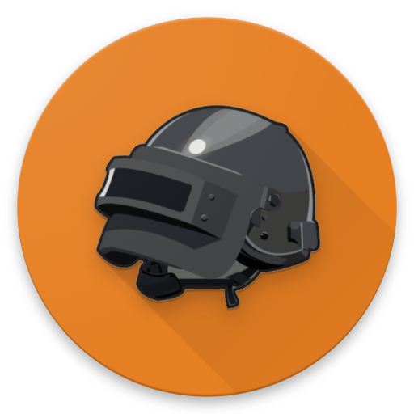

# CustomBotJS - A Discord Bot for PUBG Custom Game organization

Originally for /r/PUBATTLEGROUNDS aka PUBGReddit

Based on [CustomsBot](https://github.com/Samwalton9/CustomsBot) by SamWalton.

[](https://www.codefactor.io/repository/github/danbennettuk/custombotjs) [](https://depfu.com/github/DanBennettUK/CustomBotJS?project_id=8443) [](https://github.com/DanBennettUK/CustomBotJS/releases) [](https://www.buymeacoffee.com/danbennett)

<div align="center">
    
</div>

## 📋 Requirements:

These are the required libraries/packages to run this bot:

-   [Node](https://nodejs.org/en/)
-   [Discord.JS](https://discord.js.org)

## 🔧 Configure:

This table outlines what the configuration settings are in `config.json`.

| Config Option                  |                                    Description                                    |                            Example                            |
| ------------------------------ | :-------------------------------------------------------------------------------: | :-----------------------------------------------------------: |
| `token`                        |                                 Discord Bot Token                                 | `N345798SDG98NBDSFGLKHlh4.8sdglh.dfg8oe4lkndf_dhg0934sg2qevM` |
| `prefix`                       |                                  Command Prefix                                   |                              `$`                              |
| `host_channel_id`              |                       ID token of the hosts Discord channel                       |                       `40972350972635`                        |
| `games_channel_id`             |     ID token of the Discord channel where votes and passwords will be posted      |                       `40972350972635`                        |
| `chat_channel_id`              |                 ID token of the Discord channel used for chatting                 |                       `40972350972635`                        |
| `host_role_id`                 |                        ID token of the hosts Discord role                         |                       `40972350972635`                        |
| `custom_role_id`               |             ID token of the Custom games Discord role for mentioning              |                       `40972350972635`                        |
| `version`                      |                     Version of the bot. Should be left as is                      |                            `0.0.1`                            |
| `default_timer`                |                     Default time in minutes for timers to use                     |                              `2`                              |
| `activity => streaming`        |                     Show whether bot is live on Twitch or not                     |                            `false`                            |
| `activity => twitchUsername`   |              Twitch Username for the bot to show when above is true               |                         `DanBennett`                          |
| `activity => game`             |                            Game playing in bot status                             |                `PlayerUnknown's BattleGrounds`                |
| `default_game_server_name`     |     Default Custom Game Server Name (can be overridden by `password` command)     |                            `true`                             |
| `default_game_server_password` |   Default Custom Game Server Password (can be overridden by `password` command)   |                            `true`                             |
| `host_channel_messages`        |          Choose whether results of votes are posted in the hosts channel          |                            `true`                             |
| `custom_role_ping`             | Choose whether the Custom role set by `custom_role_id` should be pinged/mentioned |                            `true`                             |
| `debug_enable`                 |                     Enable or Disable debugging (false = off)                     |                            `false`                            |

## 🚀 Usage:

```shell
$ node . # I'll script this later.
```

## 📄 License:

GPL-3.0 © [Dan Bennett](https://github.com/DanBennettUK/CustomBotJS/blob/master/LICENSE)
